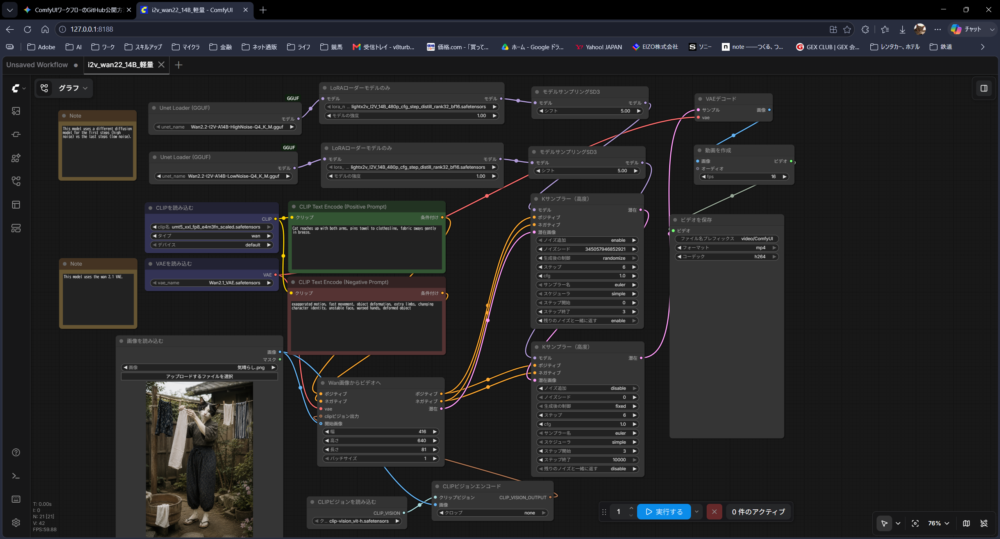

# Hi there, I'm a Local AI Creator / Architect 👋

I focus on creating 5-second silent cinematic videos using local AI, emphasizing the beauty of subtraction and subtle atmosphere ("ma"). 
This profile serves as a technical portfolio for optimizing heavy AI models on a mid-range hardware setup.

## 🛠️ Machine Specifications & Environment
* **OS:** Windows 11 (Optimized for resource management)
* **CPU:** Intel Core i5-12400F
* **GPU:** NVIDIA GeForce RTX 3060 Ti (VRAM 8GB)
* **RAM:** 32GB
* **Display:** Dual monitor setup (including EIZO ColorEdge CG248-4K for professional color management)

## 🚀 Local AI Workflows & Benchmarks

### 🎥 Wan2.2 / Wan2.1 (ComfyUI)
Currently running heavy text-to-video / image-to-video models under strict **VRAM 8GB limitations**.

* **Quantization:** Utilizing Q4 GGUF / NF4 models to bypass OOM (Out of Memory) and maintain stability.
* **VRAM Optimization:** Custom node management and strict VRAM caching rules in ComfyUI (Forge-based optimization logic).
* **Cinematic Video Pipeline:** 
  1. Low-VRAM Generation via ComfyUI (GGUF).
  2. High-fidelity upscaling via **Topaz Video AI**.
  3. Final editing, color management, and pacing adjustments via **Adobe Premiere Pro**.

### 🚀 Optimized Workflows
You can find my custom production workflow in the `workflows/` directory.

#### Wan2.2 Image-to-Video (14B GGUF Split-Sampling)
A highly optimized I2V workflow designed to bypass OOM on 8GB VRAM while retaining high-fidelity motion. It features a dual-KSampler setup that switches between different diffusion models for early and late denoising steps.

* **File:** `workflows/i2v_wan2.2_14b_lightweight.json`
* **Workflow Architecture:**
  

##### 🧩 Required Custom Nodes
* `ComfyUI-WanVideoWrapper`
* `ComfyUI-GGUF`
* `ComfyUI-VideoHelperSuite`

##### 💾 Required Models & Paths
* **Diffusion Models (GGUF):** `ComfyUI/models/diffusion_models/`
  * `Wan2.2-I2V-14B-HighNoise-Q4_K_M.gguf` (For initial steps)
  * `Wan2.2-I2V-14B-LowNoise-Q4_K_M.gguf` (For refinement steps)
* **Text Encoder:** `ComfyUI/models/text_encoders/umt5_xxl_fp8_e4m3fn_scaled.safetensors` (Type: `wan`)
* **VAE:** `ComfyUI/models/vae/Wan2.1_VAE.safetensors` (Recommended for this setup)
* **CLIP Vision:** `ComfyUI/models/clip_vision/clip-vision_vit-h.safetensors`
* **LoRA** `ComfyUI/models/loras/lightx2v_I2V_14B_480p_cfg_step_distill_rank32_bf16.safetensors`

---

## 🇯🇵 プロフィール（日本語）
ローカルAIを活用し、無駄を削ぎ落とした5秒のサイレントシネマ（猫や日常の静寂、間をテーマにした映像作品）を制作しています。

このGitHubでは、「VRAM 8GB」という限られたミドルクラス環境で、最新の重量級動画生成モデル（Wan2.2等）をいかに枯渇（OOM）させず、かつ高品質に回すかという技術的なアプローチとワークフローの挙動を記録しています。

* **主なツール:** ComfyUI, Wan2.2 / Wan2.1, Topaz Video AI, Adobe Premiere Pro

### 🚀 公開ワークフロー
実際の制作に使用しているワークフローファイルを `workflows/` フォルダ内で公開しています。

#### Wan2.2 Image-to-Video (14B GGUF 前後段切り替え軽量化版)
VRAM 8GB環境でのOOMを回避しつつ、妥協のない挙動を得るために設計したI2Vワークフローです。2段構えのKサンプラー（高度）を使用し、動画の骨組みを作る前半（HighNoise）と、ディテールを整える後半（LowNoise）で異なるGGUFモデルを動的に切り替える玄人向けの設計になっています。

#### 🔄 2段階 K-Sampler 処理フローイメージ

```text
 ── [Total Denoise Steps: 100%] ───────────────────────────────────────┐
 └── Step 0% ─── (HighNoise GGUF) ───► Step 40% ─── (LowNoise GGUF) ───► Step 100% ┘
      [VRAM Optimizations: Model Swap triggers mid-way via Custom Node]
```

* **ファイル:** `workflows/i2v_wan2.2_14b_lightweight.json`
* **必要カスタムノード:** `ComfyUI-WanVideoWrapper`, `ComfyUI-GGUF`, `ComfyUI-VideoHelperSuite`
* **使用モデル配置:**
  * 前半用GGUF: `Wan2.2-I2V-14B-HighNoise-Q4_K_M.gguf`
  * 後半用GGUF: `Wan2.2-I2V-14B-LowNoise-Q4_K_M.gguf`
  * VAE: `Wan2.1_VAE.safetensors` (Wan2.1版VAEを推奨)

---

## 🔗 Links
* **YouTube:** [http://www.youtube.com/@VRAM8GB_ComfyUI_Wan2.2] (Cinematic Shorts Archive)
